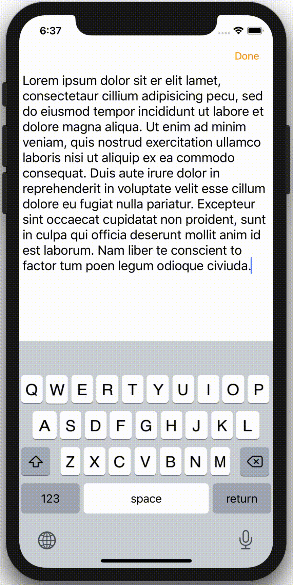

# CustomKeyboard_Portfolio

## 개요

### : 기존의 Keyboard 보다 더욱 다양한 기능을 추가하여 사용자의 편의성을 향상시킨 iOS Keyboard

---

## 주요 기능

### 1. 실행 취소

#### * Undo 버튼이 생성되는 조건

</img>

> 글을 입력하거나 삭제 시 Undo 버튼이 활성화 된다.
>
> 또한 Undo 버튼을 Touch Down 후 Undo 버튼의 영역을 벗어난뒤 Touch Up 하면 Undo가 실행된다.
>
> 단 Undo를 원하지 않는 경우 터치를 때지 않고 Undo 버튼의 영역으로 다시 들어가면 Undo가 실행되지 않는다.

#### * 글자 수에 따른 Undo

> Undo 버튼을 오른쪽으로 Swipe 후 손을 때지 않고 0.3초간 유지하면 원하는 글자 수 만큼 Undo를 할 수 있다.
>
> 1Step(한 글자), 2Steps(두 글자), 3Steps(세 글자), Serires(전체)
>
> 입력된 글자 수에 따라 선택할 수 있는 글자 수 가 다르다
>
> 한 글자만 입력한 경우 따로 선택 없이 Undo를 실행한다.

### 2. 재실행

> Undo를 실행하면 Redo 버튼이 활성화 된다.
>
> Undo와 마찬가지로 Redo 버튼을 Touch Down 후 영역을 벗어난 뒤 Touch Up 하면 Redo가 실행된다.
>
> Redo를 원하지 않는 경우 Undo 와 마찬가지로 Toych Down 후 손을 때지 않고 Redo 버튼의 영역으로 들어가면 Redo가 실행되지 않는다.

### 3. 삭제

#### * Delete 기능 모두 보기

</img>

> Delete 버튼을 LongPress하면 손가락 이동에 따른 다양한 기능들을 볼 수 있고, 각 기능들을 동작시킬 수 있다.

#### * Back Delete

</img>

> Delete 버튼을 Touch Down 하고 위로 이동하여 Touch Up하면 뒤에 글자를 지우는 Back Delete 기능을 수행하게 된다.

#### * Delete 속도 조절

</img>

> Delete 버튼을 Touch Down 후 왼쪽으로 이동하면 Delete의 속도를 조절하며 Delete 할 수 있다.

#### * Drag를 이용한 선택 삭제

</img>

> Delete 버튼을 Touch Down 후 왼손을 Touch Down 하면 Cursor를 원하는 만큼 이동시킬 수 있으며 이동 후 Delete 버튼을 Touch Up 하면 이동한 만큼 글자가 삭제된다.

---

## Develop Environment

- Xcode 11
- Swift 5.0
- Keyboard Extension

---

